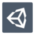

<html lang="en" data-color-mode="auto" data-light-theme="light" data-dark-theme="dark" data-a11y-animated-images="system" data-turbo-loaded="">

	<h1 align="center" style="font-size:20rem;">Hi,I am omer👋</h1>
  

  

  

  

<h3 align="center">software developer👨‍💻</h3>
  <h4 align="center">&ltin the making/&gt  :)<h4>
  

  

  
<h2 align="center">🔥about🔥</h2>

  

  

  
-I have been learning software development for about a year now (2022),
looking to expand my knowledge and build a lot of cool stuff with the community! 

  

  

<h2 align="center">🦾Skils🦾</h2>

  

  
 -I am most comfortable working with c# as it was the first programing language I learned and built most projects in, ranging from web apps with the dot net framework to games with the unity game engine,but i can also hold my own when working with javascript or python.  
I also have some experience working with CSS and HTML as I build all of the UI for my websites myself.  I'm quick to pick up new teqnolagis and always want to learn more!

  

  <h3 align="center">languages</h3>
 

  

 
 
  
   
    

  <h3 align="center">frameworks</h5>
  

  

 
 
  

  
<h2 align="center">🎯goal🎯</h2>

  

  

  
-My main goal with my git hub account is to contribute as much as possible to open source software and maybe learn a thing or two along the way

  

  

<h2 align="center">📋Stats📋</h2>

